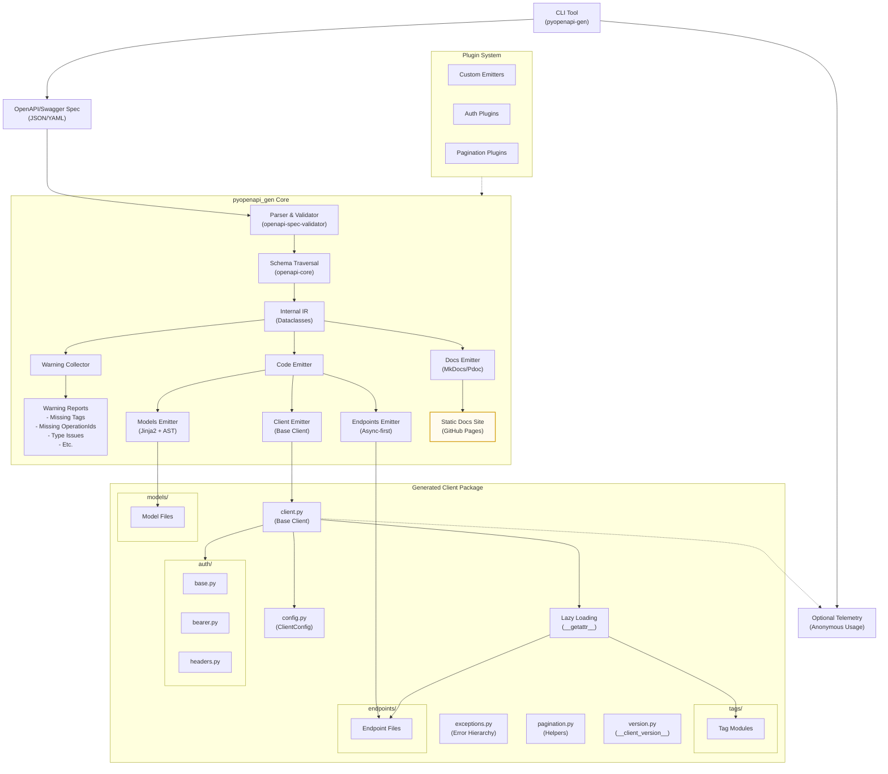

# Architecture Diagram



## Architecture Description

The diagram above illustrates the architecture of our Python Swagger client generator. The system follows a clear data flow:

1. **Input**: OpenAPI/Swagger specification document (JSON/YAML format)

2. **Processing Pipeline**:
   - **Parser & Validator**: Uses openapi-spec-validator to validate the spec and ensure it meets the OpenAPI 3.1 standard
   - **Schema Traversal**: Uses openapi-core to traverse the schema structure and extract relevant information
   - **Internal IR**: Converts the OpenAPI spec into internal intermediate representation using dataclasses
   - **Warning Collection**: Identifies and collects issues in the spec (missing tags, operationIds, etc.)
   - **Code Emitter**: Generates code using templates and AST manipulation
     - Models Emitter: Generates data model classes
     - Endpoints Emitter: Generates API endpoint methods 
     - Client Emitter: Generates the base client implementation

3. **Output**: A structured Python package with additional utilities:
   - `config.py` containing `ClientConfig` (timeouts, retries, base_url)
   - `pagination.py` with strategy‑specific pagers
   - `version.py` embedding generator + spec version

4. **Documentation Site**: Static site produced via MkDocs Material hosted on GitHub Pages, generated alongside code.

5. **Telemetry (Opt‑in)**: Anonymous usage events to help prioritise features; disabled by default.

6. **Extension Points**: In addition to plugins, users may hook into middleware layers for logging/tracing.

This architecture ensures a maintainable, testable, and extensible code generation system with clear separation of concerns and modular components. 

## Client Customization

The generator supports customizing the output through various command-line parameters:

```
pyopenapi-gen gen <spec_url> [options]

Options:
  -o, --output PATH         Output directory for generated client [required]
  --name TEXT               Custom name for the generated client package [default: derived from spec title]
  --async-only              Generate only async client (default)
  --include-sync            Also generate synchronous client methods
  --verbose                 Show detailed output including warnings
  --strict                  Fail on any warnings in the OpenAPI spec
  --auth PLUGIN[,PLUGIN]    Authentication plugins to include (default: bearer,headers)
```

The `--name` parameter allows users to specify a custom package name for the generated client, making it easy to integrate into existing codebases with specific naming conventions. For example:

```bash
# Generate a client named "acme_api_client"
pyopenapi-gen gen https://api.example.com/openapi.json --name acme_api_client
```

This will produce a package structure like:

```
acme_api_client/
├── __init__.py
├── client.py
├── exceptions.py
├── models/
│   └── ...
├── tags/
│   └── ...
└── endpoints/
    └── ...
```

The generator will automatically adjust all imports and references to use the custom package name. 

## Authentication Plugin System

The generator includes a pluggable authentication system that provides a consistent interface for different authentication methods. By default, the following authentication methods are included:

### Bearer Token Authentication
```python
# Example usage of generated client with bearer auth
from my_api_client import create_client

client = create_client(auth={"type": "bearer", "token": "your-token-here"})
# or
from my_api_client.auth import BearerAuth
client = create_client(auth=BearerAuth("your-token-here"))

# Make authenticated requests
results = await client.pets.list_pets()
```

### Custom Headers Authentication
```python
# Example usage with custom headers
from my_api_client import create_client

client = create_client(auth={"type": "headers", "headers": {
    "X-API-Key": "your-api-key", 
    "X-Tenant-ID": "tenant-123"
}})
# or
from my_api_client.auth import HeadersAuth
client = create_client(auth=HeadersAuth({
    "X-API-Key": "your-api-key", 
    "X-Tenant-ID": "tenant-123"
}))
```

### Creating Custom Authentication Plugins
Users can create their own authentication plugins by implementing the base authentication interface:

```python
from my_api_client.auth import BaseAuth
import base64

class BasicAuth(BaseAuth):
    def __init__(self, username: str, password: str):
        self.username = username
        self.password = password
    
    async def authenticate_request(self, request_args: dict) -> dict:
        if "headers" not in request_args:
            request_args["headers"] = {}
            
        credentials = f"{self.username}:{self.password}"
        encoded = base64.b64encode(credentials.encode()).decode()
        request_args["headers"]["Authorization"] = f"Basic {encoded}"
        
        return request_args
```

The authentication plugin system is designed to be extensible, allowing users to implement authentication methods specific to their API needs. 