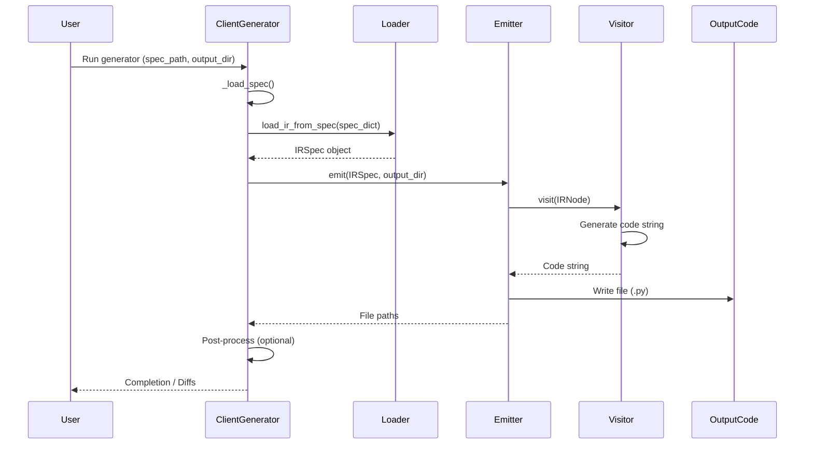

# Architecture Overview

This document outlines the architecture of the `pyopenapi_gen` Python OpenAPI client generator, explaining the roles of its core components and the overall data flow during code generation.

## Core Components

The generator is composed of several distinct components, each with a specific responsibility. Understanding these components is key to understanding the generation process.

```mermaid
graph TD
    A[Input Spec (YAML/JSON)] --> B(Orchestration / ClientGenerator);
    B --> C(Parser / Loader);
    C --> D{Intermediate Rep. (IR)};
    B --> E(Emitters);
    E --> F(Visitors);
    F --> D;
    F --> G(Helpers / CodeWriter);
    E --> G;
    E --> H[Output Code (.py)];
    I(Core Runtime) --> E;
    E --> J(Context / RenderContext);
    F --> J;
```
*Diagram: High-level component interaction.* 

1.  **Parser & Loader (`src/pyopenapi_gen/core/loader.py`)**: Responsible for taking the raw OpenAPI specification dictionary (loaded typically from YAML/JSON) and converting it into the Intermediate Representation (IR). See [Loader Details](./loader.md).

2.  **Intermediate Representation (IR) (`src/pyopenapi_gen/__init__.py`)**:
    *   Defines core dataclasses (`IRSpec`, `IROperation`, `IRParameter`, `IRRequestBody`, `IRResponse`, `IRSchema`) that represent the normalized and validated OpenAPI specification.
    *   Acts as a stable, typed interface between the parser and the code generators.
    *   All code generation is based *only* on the IR, not the raw spec dictionary.
    *   See [IR Models Details](./ir_models.md).

3.  **Visitors (`src/pyopenapi_gen/visit/`)**:
    *   Implement the visitor pattern to traverse the nodes of the IR.
    *   Each visitor is specialized for generating a specific type of code artifact:
        *   `ModelVisitor`: Generates Python dataclasses/enums from `IRSchema`. See [Model Visitor Details](./model_visitor.md).
        *   `EndpointVisitor`: Generates client methods for API operations from `IROperation`. See [Endpoint Visitor Details](./endpoint_visitor.md).
        *   `ClientVisitor`: Generates the main `APIClient` class aggregating endpoint clients.
        *   `ExceptionVisitor`: Generates exception classes/aliases.
        *   `DocsVisitor`: Generates Markdown documentation (future capability).
    *   They utilize helper modules (like `CodeWriter`) to build the code strings.

4.  **Emitters (`src/pyopenapi_gen/emitters/`)**:
    *   Orchestrate the generation process for distinct parts of the output package (models, endpoints, client, core, exceptions, docs).
    *   Instantiate and use the appropriate `Visitor` to generate code content.
    *   Handle file I/O, writing the generated code to the correct locations within the output package structure.
    *   Examples: `ModelsEmitter`, `EndpointsEmitter`, `ClientEmitter`, `CoreEmitter`.

5.  **Helpers (`src/pyopenapi_gen/helpers/`)**:
    *   Provide utility functions and classes used during generation.
    *   Likely includes `CodeWriter` for formatted code construction, `NameSanitizer` for Python identifier generation, etc.
    *   See [Helpers Details](./helpers.md).

6.  **Context (`src/pyopenapi_gen/context/`)**:
    *   Likely contains classes like `RenderContext` to manage state during code generation (e.g., tracking necessary imports, file paths).
    *   See [Render Context Details](./render_context.md).

7.  **Core Runtime (`src/pyopenapi_gen/core/`)**:
    *   Contains base classes, protocols, and utilities *copied* into the generated client's `core` directory (or shared location).
    *   Includes essential runtime components like `HttpTransport`, `BaseAuth`, base exceptions, etc.
    *   Ensures the generated client is independent of `pyopenapi_gen` itself at runtime.

8.  **Orchestration (`src/pyopenapi_gen/generator/client_generator.py`)**:
    *   The `ClientGenerator` class ties everything together.
    *   It loads the spec, invokes the parser (`load_ir_from_spec`), manages warnings, calls the appropriate emitters, handles diffing (optional), and manages post-processing steps.

## Generation Flow

The process of generating a client follows these sequential steps:


*Diagram: Sequence of operations during client generation.*

1.  **Load Spec**: `ClientGenerator` loads the OpenAPI spec file (YAML/JSON) into a Python dictionary.
2.  **Parse to IR**: `load_ir_from_spec` processes the dictionary, resolves references (where possible), validates structure, and builds the `IRSpec` object containing all IR nodes.
3.  **Emit Code**: `ClientGenerator` invokes the various `Emitters` (`CoreEmitter`, `ModelsEmitter`, `EndpointsEmitter`, `ClientEmitter`, etc.).
4.  **Visit & Render**: Each `Emitter` uses its corresponding `Visitor` to traverse the relevant parts of the `IRSpec`.
5.  **Generate Code**: `Visitors` use `Helpers` (like `CodeWriter`) to render Python code strings for classes, methods, etc.
6.  **Write Files**: `Emitters` write the generated code strings to the appropriate `.py` files in the specified output directory structure.
7.  **Post-process**: Optional steps like running code formatters (e.g., Ruff, Black) or type checkers (`mypy`) on the generated code. 