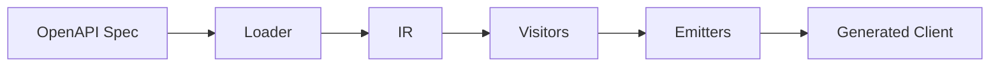

# Architecture Overview

PyOpenAPI Generator follows a three-stage pipeline: Load → Visit → Emit. This document explains the core components and data flow.

## System Overview



The generator transforms OpenAPI specifications into self-contained Python clients through a clean separation of concerns.

## Core Components

### 1. Loader System (`core/loader/` & `core/parsing/`)
Transforms OpenAPI specs into typed Intermediate Representation:
- **Unified Cycle Detection**: Handles complex schema relationships and recursion
- **Schema Parser**: Core parsing logic with reference resolution
- **Keyword Processors**: Specialized handlers for `allOf`, `oneOf`, `anyOf`
- **Transformers**: Extract inline enums, promote nested objects

### 2. Intermediate Representation (IR)
Typed dataclasses representing normalized OpenAPI components:
- `IRSpec`, `IROperation`, `IRSchema`, `IRParameter`
- Stable interface between parsing and code generation
- All generation based on IR, not raw spec

### 3. Visitor System (`visit/`)
Implements visitor pattern for code generation:
- **ModelVisitor**: Python dataclasses/enums from schemas
- **EndpointVisitor**: Async methods from operations  
- **ClientVisitor**: Main API client class
- **ExceptionVisitor**: Error hierarchies

### 4. Emitter System (`emitters/`)
Orchestrates file generation:
- **ModelsEmitter**: Creates `models/` directory
- **EndpointsEmitter**: Creates `endpoints/` with operations
- **CoreEmitter**: Copies runtime dependencies
- **ClientEmitter**: Main client interface

### 5. Supporting Systems
- **Context**: Manages rendering state and imports
- **Writers**: Code formatting utilities
- **Helpers**: Type resolution and utilities

## Generation Pipeline

```
OpenAPI Spec → IR → Code → Files
```

1. **Load**: Parse YAML/JSON spec into `IRSpec` with cycle detection
2. **Visit**: Transform IR nodes into Python code strings
3. **Emit**: Write structured package with proper imports  
4. **Post-process**: Format and type-check generated code

## Unified Cycle Detection

Critical system preventing infinite recursion during schema parsing:

### Detection Types
- **Structural Cycles**: Reference loops (A → B → A)
- **Self-References**: Direct self-references (A → A)  
- **Depth Limits**: Configurable recursion limits

### Resolution Strategies
- **Referential Stubs**: For allowed self-references
- **Placeholders**: For problematic cycles and depth exceeded
- **State Tracking**: Schema lifecycle management

Implementation in `core/parsing/unified_cycle_detection.py` provides conflict-free detection across all parsing scenarios. 